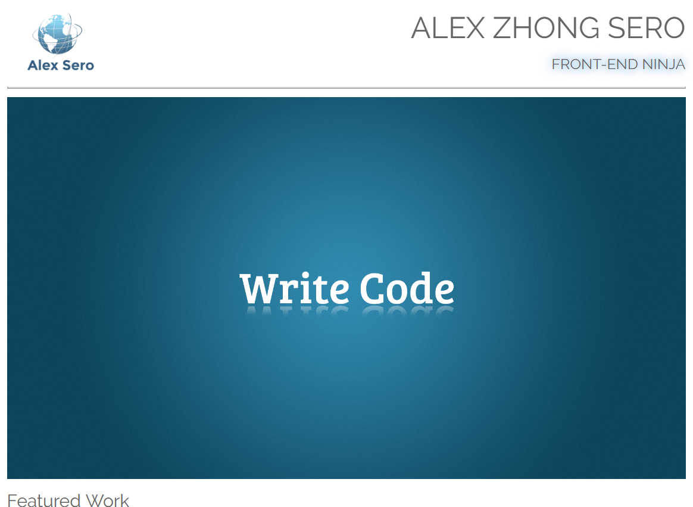

# Project-2-Portfolio-Site
Udacity Full Stack nanodegree project 2--to build a portfolio website, provided with a design mockup. 

This is a one page responsive website, using designs from Bootstrap framwork, that showcases various Udacity and personal projects I have done.

The visual design of this website was provided by Udacity as an exercise in taking a design mock up and coding it up. 
